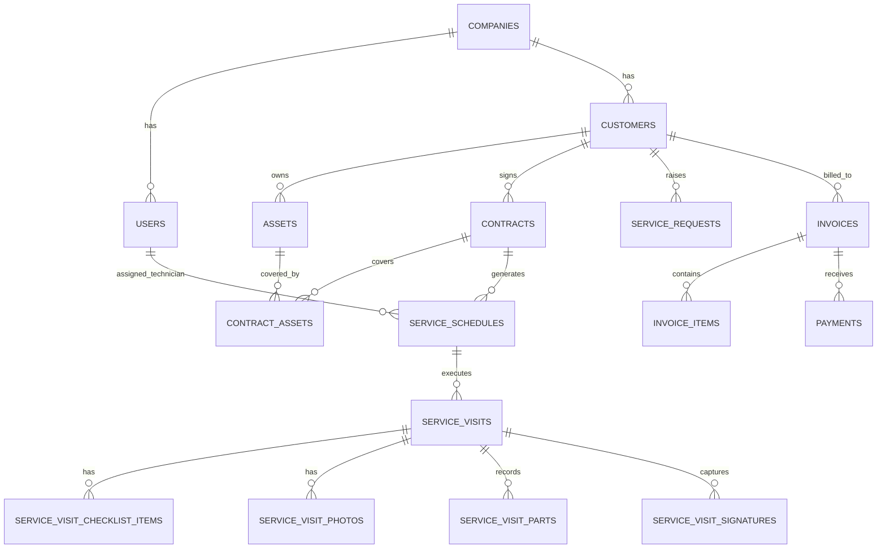

# AMC360 — Database Schema & Architecture

## 1. Relational Architecture Overview
The database is built on normalized MySQL/MariaDB with strict foreign key constraints, cascading rules, and multi-tenant scoping via `company_id`.

## 2. Table Specifications

### `companies`
- Multi-tenant tenant record.
- Houses company branding (`primary_color`, `secondary_color`, `logo_url`), numbering prefixes (`customer_prefix`, `contract_prefix`, `service_request_prefix`, `service_visit_prefix`, `service_report_prefix`, `invoice_prefix`), tax configurations, and business type.

### `users`
- System actors: `admin`, `technician`, `customer`.
- Technicians have `skills` JSON array and `availability_status` (`available`, `busy`, `on_leave`, `inactive`).
- Customers have `customer_id` linking to their company profile.

### `customers`
- Soft-deletable client registry (`customer_code`, `name`, `company_name`, `phone`, `email`, `address`, `status`).

### `assets`
- Machine inventory (`asset_code`, `brand`, `model`, `serial_number`, `capacity`, `warranty_start`, `warranty_end`, `qr_token`, `status`).

### `contracts`
- Core AMC agreement (`contract_number`, `duration_type`, `service_frequency`, `frequency_interval_value`, `first_visit_rule`, `visit_count_type`, `included_visit_count`, `total_price`, `sla_response_time`, `status`).

### `service_schedules`
- Planned preventive and breakdown appointments (`scheduled_date`, `time_start`, `time_end`, `visit_type`, `status`, `technician_id`).

### `service_visits`
- Real-time field execution records (`visit_number`, `started_at`, `completed_at`, GPS coordinates, `work_performed`, `findings`, `recommendations`, `report_number`, `client_operation_id` for idempotency).

### `invoices` & `payments`
- Financial ledger preserving historical applied `tax_rate`, `tax_amount`, `discount_amount`, `paid_amount`, and `balance_due`.

### `sync_operations`
- Tracks offline mobile transactions with client UUIDs (`local_operation_id`) preventing double-application of visits, photos, or payments.
